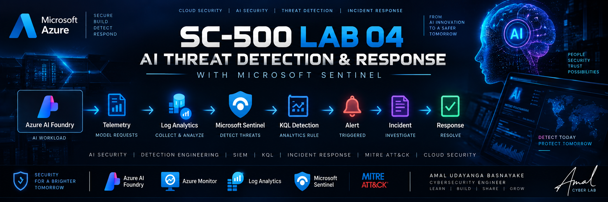

# 🛡️ SC-500 Lab 04 — AI Threat Detection & Response with Microsoft Sentinel

> Hands-on Microsoft SC-500 Cloud & AI Security Engineer lab demonstrating AI workload telemetry, detection engineering, KQL analytics, Microsoft Sentinel alerting, incident investigation, classification, and resolution.


---

## 📌 Overview

This hands-on lab demonstrates how to build an **AI security monitoring, detection, investigation, and response workflow** using **Azure AI Foundry, Azure Monitor, Log Analytics, and Microsoft Sentinel**.

The objective was not simply to deploy an AI workload, but to implement an operational security capability capable of detecting abnormal AI model invocation activity and driving that activity through a complete **SOC incident lifecycle**.

### Security Workflow

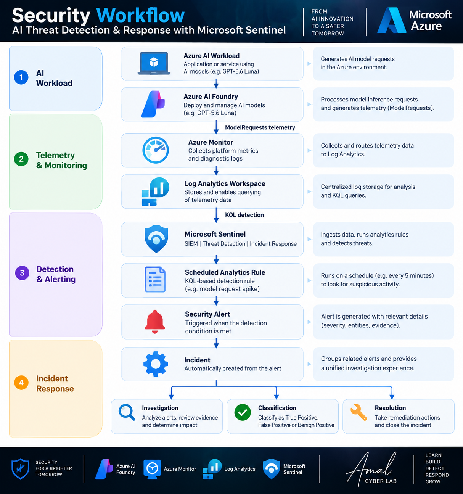

---

# 🎯 Lab Objectives

This lab was designed to demonstrate the ability to:

- Deploy a controlled Azure AI security lab environment
- Deploy and test an AI model workload
- Enable AI workload diagnostic telemetry
- Identify security-relevant AI metrics
- Ingest telemetry into Log Analytics
- Perform security analytics using KQL
- Engineer a Microsoft Sentinel detection rule
- Map the detection to MITRE ATT&CK
- Generate and validate a security alert
- Investigate the resulting Sentinel incident
- Classify the activity appropriately
- Document the investigation
- Resolve the incident using a SOC workflow
- Apply Azure cost-control principles

---

# 🏗️ Architecture

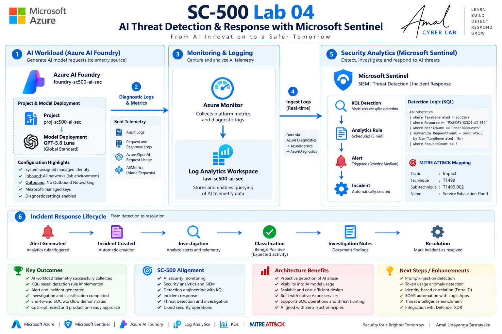

## Architecture Components

| Component | Purpose |
|---|---|
| Azure AI Foundry | Hosts the controlled AI workload |
| GPT-5.6 Luna | AI model used for controlled telemetry generation |
| Azure Monitor | Provides platform metrics and monitoring |
| Log Analytics | Central telemetry analysis layer |
| Microsoft Sentinel | SIEM and security detection platform |
| KQL | Detection and investigation language |
| MITRE ATT&CK | Threat behavior classification |
| Sentinel Incident | Investigation and response workflow |

---

# ☁️ Azure Environment

| Resource | Configuration |
|---|---|
| Resource Group | `rg-sc500-ai-sec-lab` |
| Log Analytics | `law-sc500-ai-sec` |
| Azure AI Foundry | `foundry-sc500-ai-sec` |
| Foundry Project | `proj-sc500-ai-sec` |
| Region | East US |
| Model | GPT-5.6 Luna |
| Deployment Type | Global Standard |
| Sentinel | Enabled |
| Managed Identity | System-assigned |
| Inbound Networking | All networks |
| Outbound Networking | No Outbound Networking |
| Encryption | Microsoft-managed keys |

> **Cost-control note:** This lab intentionally avoided unnecessary supporting resources such as Application Insights, Storage Accounts, Event Hubs, private endpoints, and automation infrastructure. The objective was to demonstrate AI security monitoring while keeping the lab cost-conscious.

---

# 🔐 Security Design

## Identity

The Azure AI Foundry resource uses a **system-assigned managed identity**.

This avoids embedding long-lived credentials into applications and follows Azure identity best practices.

## Network Security

For this lab, inbound networking was intentionally left publicly accessible because the primary objective was **AI telemetry, detection engineering, and incident response**.

A separate Zero Trust / Private Endpoint lab covers private networking.

Outbound networking was configured as:

```text
No Outbound Networking
```

This reduces unnecessary external connectivity from the AI workload.

## Encryption

Microsoft-managed encryption keys were used.

Customer-managed keys were intentionally excluded because key management was outside the primary objective of this detection engineering lab.

---

# 🤖 AI Workload

A controlled Azure AI Foundry project was created and a GPT-5.6 Luna deployment was configured.

### Controlled Validation Prompt

```text
This is a controlled SC-500 security telemetry test.
Respond with: AI telemetry test successful.
```

Expected response:

```text
AI telemetry test successful.
```

This confirmed that the model deployment was operational before generating security telemetry.

## Evidence


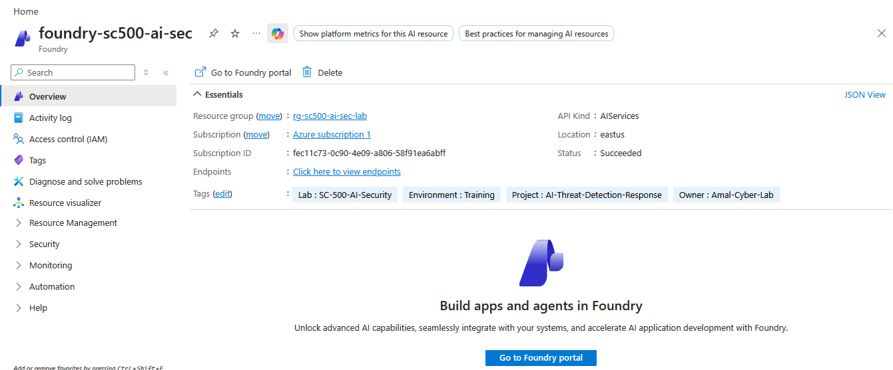
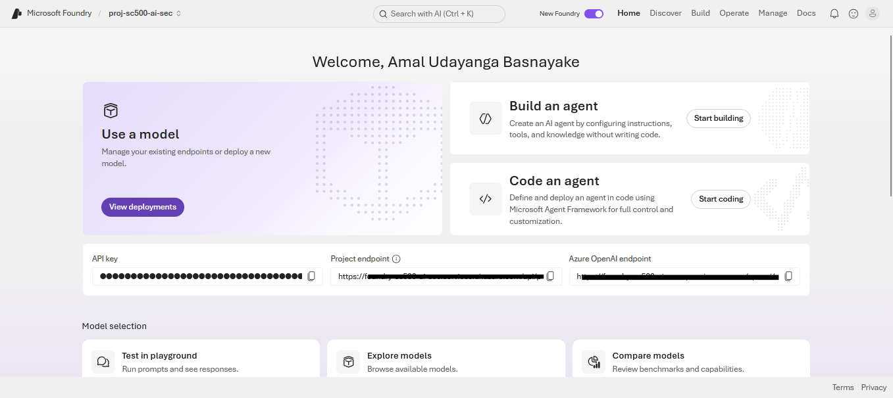
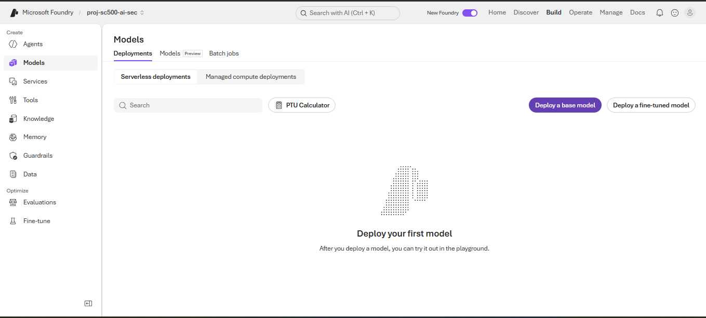
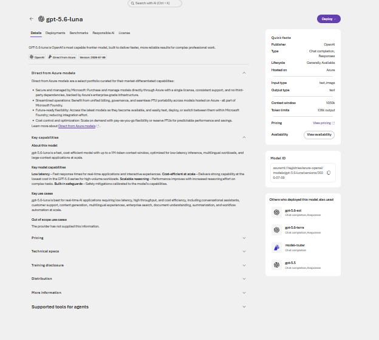
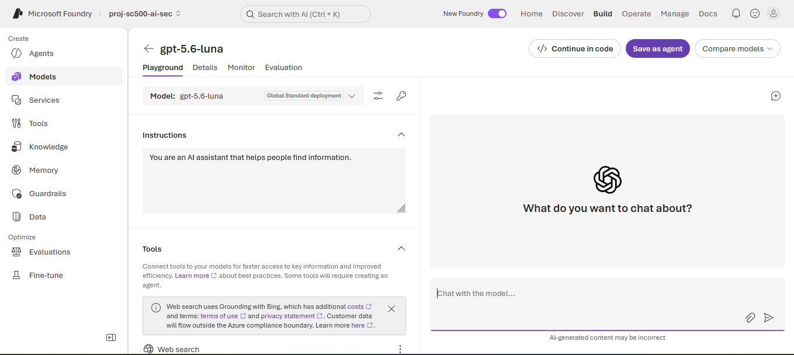
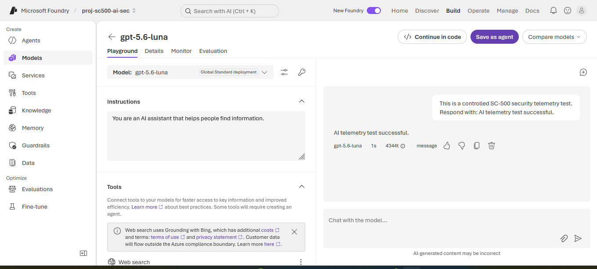


---

# 📊 AI Telemetry Collection

Diagnostic settings were configured to send relevant Foundry telemetry to the Log Analytics workspace.

Configured categories included:

- Audit Logs
- Request and Response Logs
- Azure OpenAI Request Usage
- AllMetrics

Destination:

```text
law-sc500-ai-sec
```

## Evidence


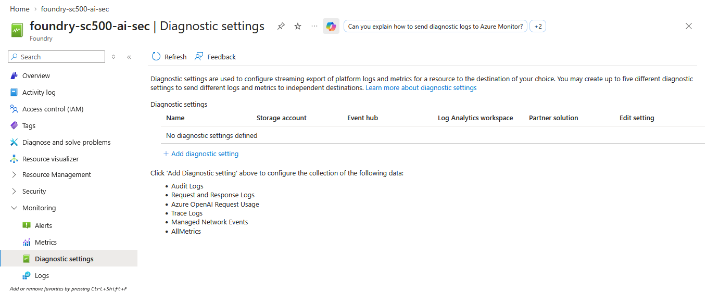
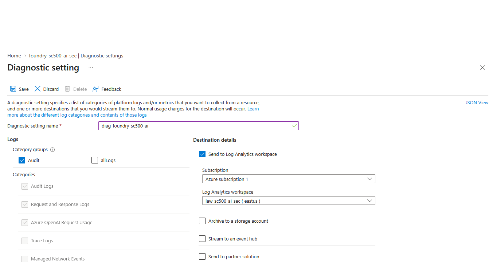
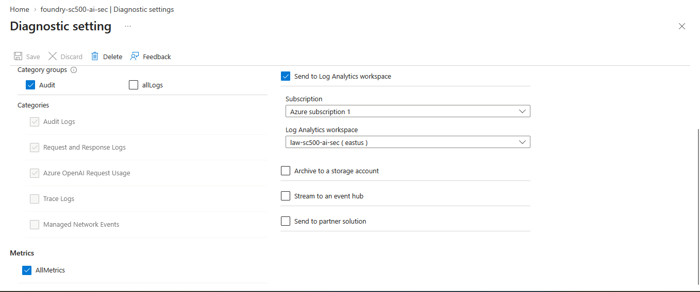


---

# 🔎 Telemetry Discovery

Initial investigation showed that request/response diagnostic events were available through:

```text
AzureDiagnostics
```

However, the available RequestResponse schema did not expose a reliable prompt/response content field suitable for this detection objective.

Instead of forcing content-based detection, the lab pivoted to **model invocation telemetry**.

This is an important detection-engineering decision:

> **Detection logic should be based on reliable telemetry fields rather than assuming that every AI request log contains usable prompt content.**

---

# 📈 ModelRequests Detection Signal

The following metric was identified as a useful security signal:

```text
ModelRequests
```

The metric represents model inference API request activity.

## Initial Validation Query

```kql
AzureMetrics
| where TimeGenerated > ago(24h)
| where Resource =~ "FOUNDRY-SC500-AI-SEC"
| where MetricName == "ModelRequests"
| project
    TimeGenerated,
    MetricName,
    Total,
    Count,
    Average,
    Minimum,
    Maximum,
    TimeGrain,
    UnitName,
    Resource
| order by TimeGenerated desc
```

## Evidence


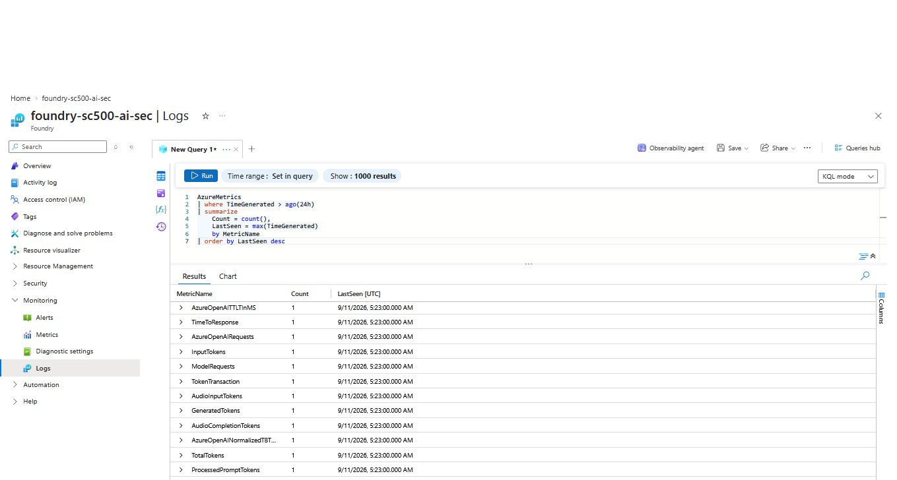
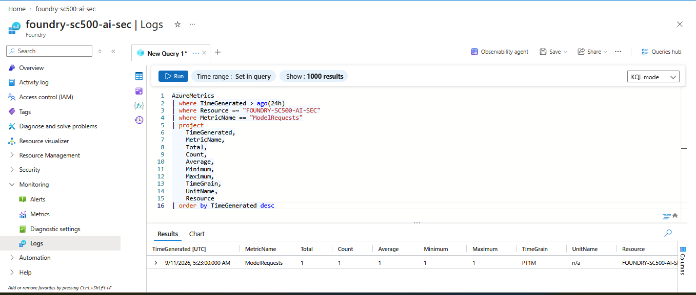
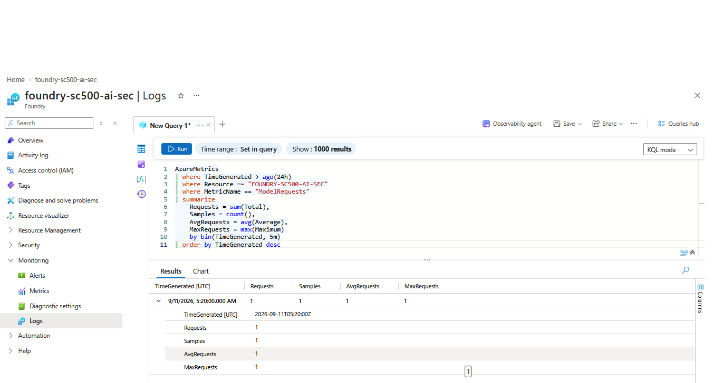


---

# 🚨 Detection Engineering

## Detection Scenario

The detection objective was to identify a sudden increase in AI model invocation activity.

Potential security implications include:

- Automated request flooding
- Excessive model consumption
- Resource exhaustion
- Abuse of an AI endpoint
- Unexpected application behavior
- Potential denial-of-service style activity

---

# 🧠 Detection Logic

A five-minute aggregation window was selected.

Detection threshold:

```text
5 or more model requests within 5 minutes
```

## KQL Detection Query

```kql
AzureMetrics
| where TimeGenerated > ago(5m)
| where Resource =~ "FOUNDRY-SC500-AI-SEC"
| where MetricName == "ModelRequests"
| summarize
    RequestCount = sum(Total),
    PeakRequests = max(Maximum)
    by bin(TimeGenerated, 5m)
| where RequestCount >= 5
```

## Detection Rationale

The rule intentionally uses:

```text
Time Window + Request Volume
```

rather than individual request content.

This makes the detection useful even when request/response logging does not expose application-level prompt content.

## Evidence


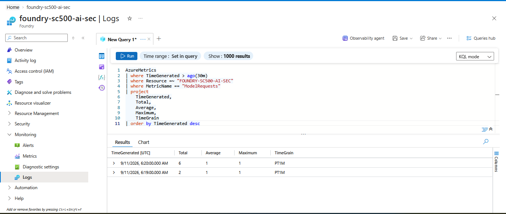
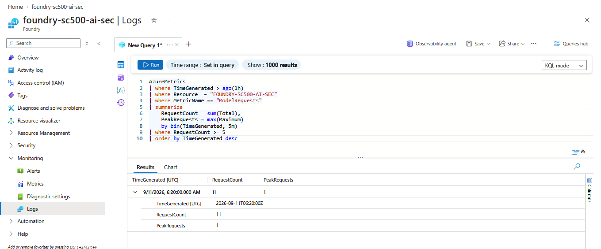


---

# 🛡️ Microsoft Sentinel Analytics Rule

## Rule Configuration

| Setting | Value |
|---|---|
| Rule Name | `AI Model Request Spike - SC500 Lab` |
| Rule Type | Scheduled Detection |
| Severity | Medium |
| Frequency | Every 5 minutes |
| Lookup Period | 5 minutes |
| Alert Threshold | Query results > 0 |
| Incident Creation | Enabled |
| Status | Enabled |
| MITRE Tactic | Impact |
| MITRE Technique | T1499 |
| MITRE Sub-technique | T1499.002 |

## Evidence


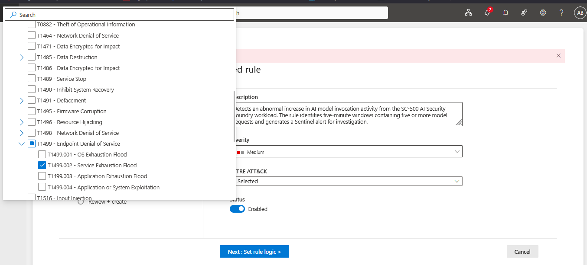
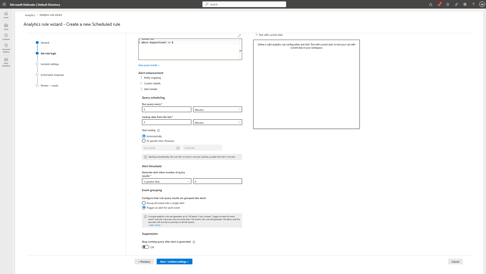
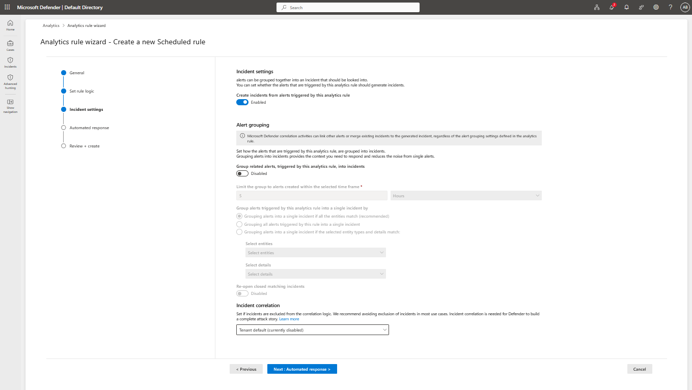
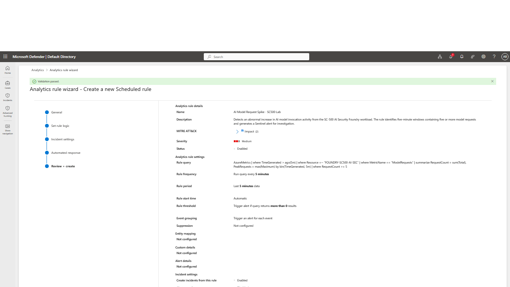
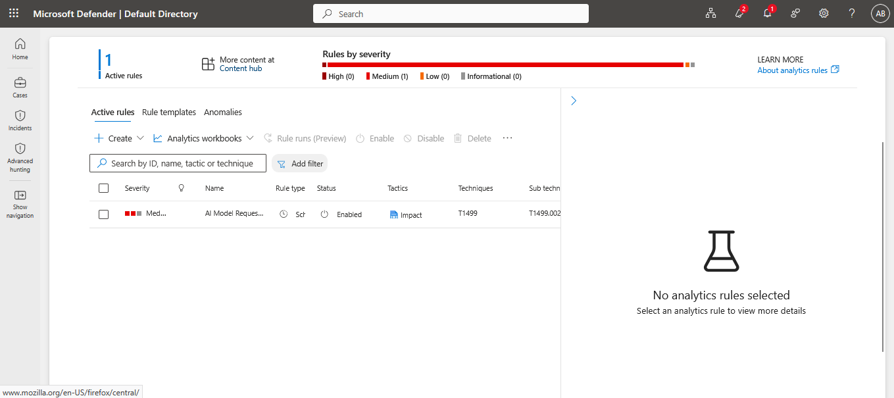


---

# 🎯 MITRE ATT&CK Mapping

The detection was mapped to:

### Tactic

```text
Impact
```

### Technique

```text
T1499 — Endpoint Denial of Service
```

### Sub-technique

```text
T1499.002 — Service Exhaustion Flood
```

The mapping reflects the behavior being detected: repeated requests that could contribute to excessive service/resource consumption.

> **Important:** The MITRE mapping represents the behavior the analytic is designed to detect. It does not mean that the controlled lab activity itself was malicious.

---

# 💥 Controlled Security Test

Controlled model requests were generated to create a measurable request spike.

The detection query successfully identified:

```text
RequestCount = 8
PeakRequests = 1
```

within the detection window.

This demonstrated that the analytics rule could identify abnormal model invocation volume.

## Evidence


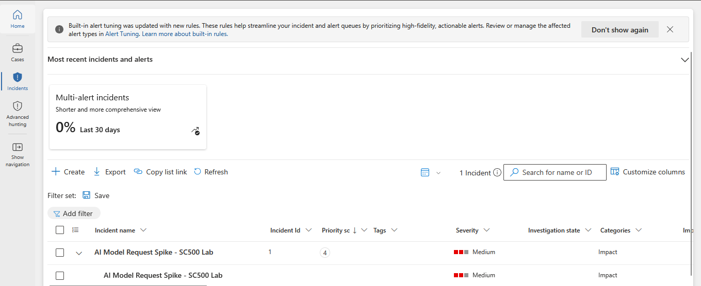
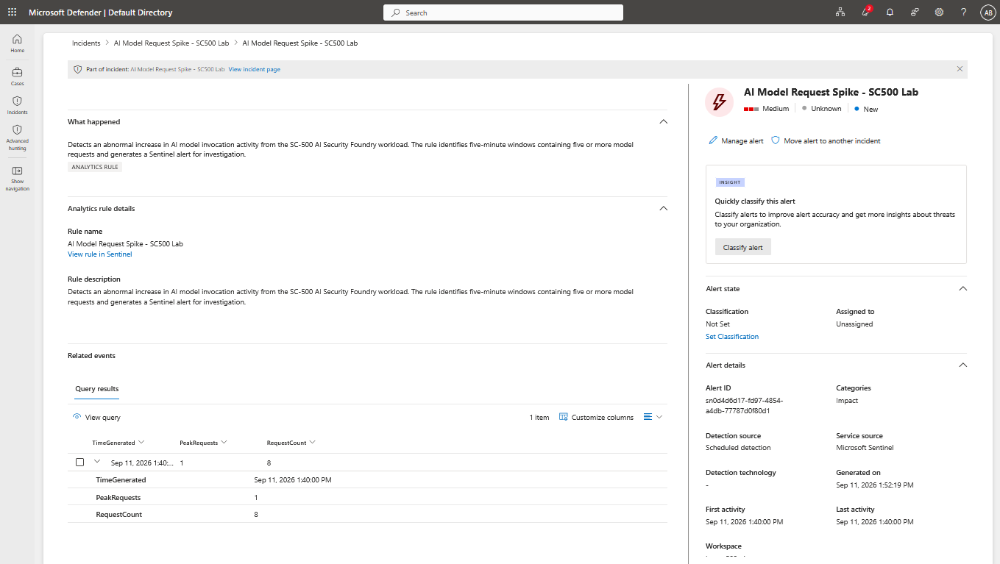
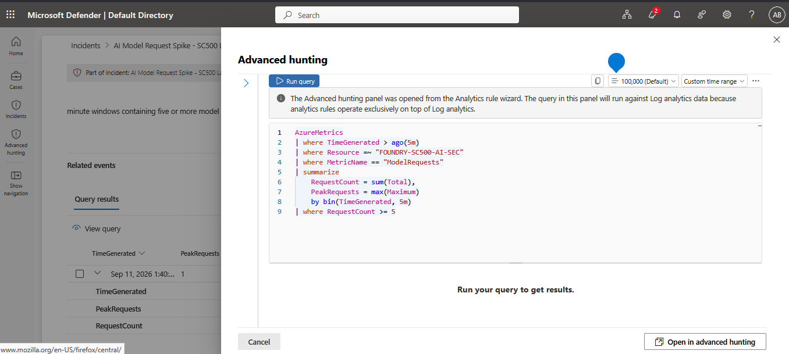


---

# 🚨 Alert Generation

The Sentinel analytics rule generated:

```text
AI Model Request Spike - SC500 Lab
```

Alert severity:

```text
Medium
```

Detection source:

```text
Scheduled Detection
```

Service source:

```text
Microsoft Sentinel
```

The alert was successfully promoted into a Sentinel incident.

## Evidence


---

# 🔬 Incident Investigation

The resulting incident was:

```text
AI Model Request Spike - SC500 Lab
```

Investigation confirmed:

- The detection rule fired correctly
- Eight model requests were observed within the detection window
- The activity originated from the controlled lab test
- No malicious activity was identified
- No unauthorized access was identified
- No remediation was required

## Evidence


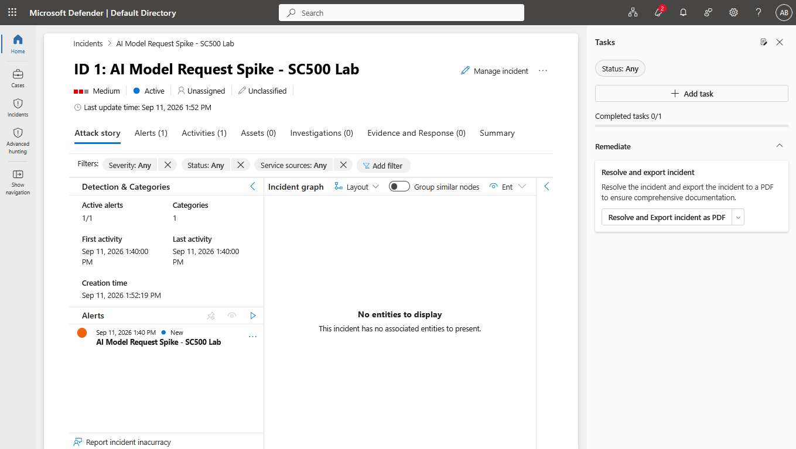

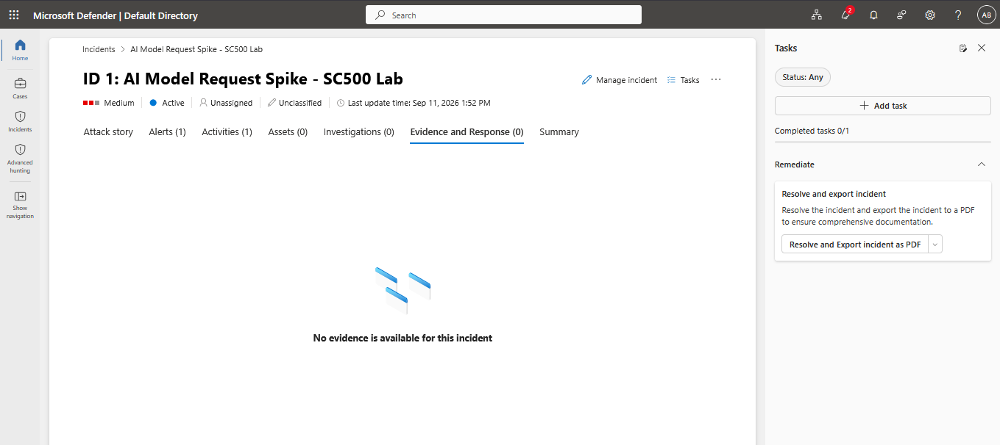
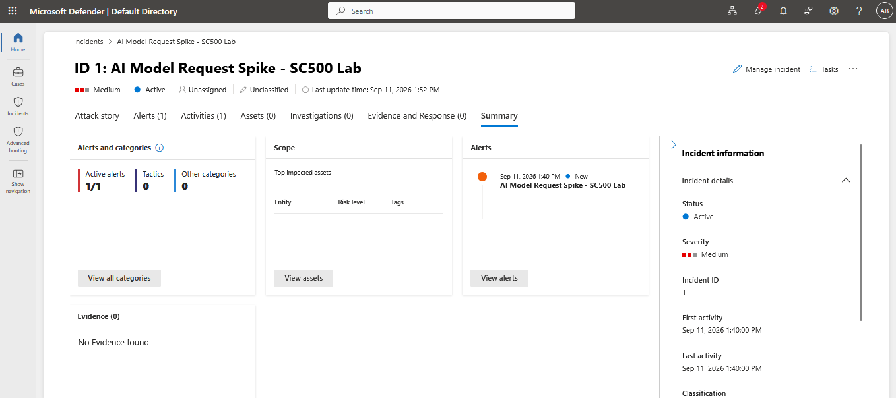


---

# 🧾 Incident Classification

Because the activity was intentionally generated as part of a controlled security test, the incident was classified as:

```text
Benign Positive
```

This demonstrates an important SOC principle:

> A detection firing successfully does not automatically mean that the underlying activity is malicious.

Analysts must validate the context before determining whether an alert represents a true positive, false positive, or expected security activity.

## Evidence


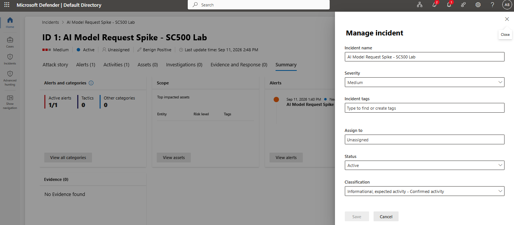


---

# 📝 Investigation Documentation

The following investigation conclusion was added to the incident:

```text
Controlled SC-500 AI telemetry test generated eight model requests
within the detection window. The Sentinel analytics rule correctly
detected the request spike. No malicious activity or unauthorized
access was identified. The incident was classified as expected
security test activity. No remediation was required.
```

## Evidence

```text
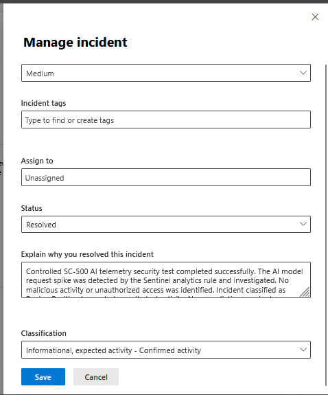
```

---

# ✅ Incident Resolution

The incident was subsequently resolved after investigation.

Final state:

```text
Status: Resolved
Severity: Medium
Classification: Benign Positive
Alerts: 1
Activities: 1
```

## Final Evidence

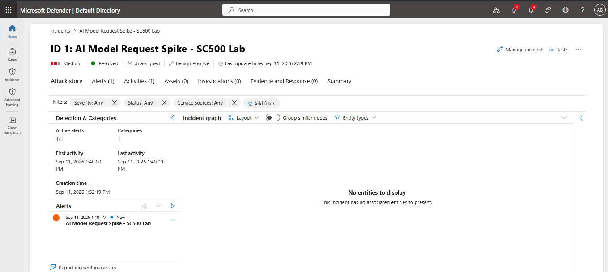


---

# 🔄 Complete SOC Lifecycle

This lab demonstrates the following operational workflow:

```text
1. AI Workload Deployment
          ↓
2. Telemetry Generation
          ↓
3. Telemetry Ingestion
          ↓
4. Security Signal Identification
          ↓
5. KQL Detection Engineering
          ↓
6. Sentinel Analytics Rule
          ↓
7. Alert Generation
          ↓
8. Incident Creation
          ↓
9. Analyst Investigation
          ↓
10. Incident Classification
          ↓
11. Investigation Documentation
          ↓
12. Incident Resolution
```

---

# 🧪 Detection Validation

The detection was independently validated using:

```kql
AzureMetrics
| where TimeGenerated > ago(1h)
| where Resource =~ "FOUNDRY-SC500-AI-SEC"
| where MetricName == "ModelRequests"
| summarize
    RequestCount = sum(Total),
    PeakRequests = max(Maximum)
    by bin(TimeGenerated, 5m)
| where RequestCount >= 5
| order by TimeGenerated desc
```

Observed validation result:

```text
RequestCount: 11
PeakRequests: 1
```

A subsequent controlled test generated an incident with:

```text
RequestCount: 8
```

This provided both **telemetry validation** and **end-to-end detection validation**.

---

# 💰 Cost Optimization

This lab was designed with Azure Startup credit conservation in mind.

## Cost-Control Decisions

- Used a single Resource Group
- Used a single Log Analytics workspace
- Avoided unnecessary Application Insights
- Avoided Storage Account integration
- Avoided Event Hub integration
- Avoided private endpoint infrastructure because it was covered by a separate lab
- Used a serverless/global standard model deployment
- Used a lightweight request-volume detection
- Did not deploy unnecessary SOAR infrastructure
- Deleted the lab Resource Group after evidence collection

## Lifecycle Strategy

```text
Build
  ↓
Test
  ↓
Capture Evidence
  ↓
Document
  ↓
Delete Lab Resources
```

This prevents completed training environments from generating unnecessary ongoing costs.

---

# 🎓 SC-500 Relevance

This lab reinforces several SC-500 security engineering capabilities.

| SC-500 Area | Lab Implementation |
|---|---|
| AI Security | Azure AI Foundry security monitoring |
| Security Monitoring | Azure Monitor + Log Analytics |
| SIEM | Microsoft Sentinel |
| Detection Engineering | KQL analytics rule |
| Incident Response | Sentinel incident lifecycle |
| Threat Detection | Model request anomaly detection |
| Governance | Resource configuration and identity |
| Security Operations | Investigation and classification |
| MITRE ATT&CK | T1499.002 mapping |
| Cloud Security | Azure-native monitoring architecture |

---

# 💼 Engineer-Level Skills Demonstrated

This project demonstrates practical experience with:

- Azure AI security monitoring
- Microsoft Sentinel
- KQL
- Log Analytics
- Azure Monitor
- Detection engineering
- Security analytics
- AI workload telemetry
- Incident investigation
- SOC operations
- MITRE ATT&CK
- Alert triage
- Incident classification
- Incident lifecycle management
- Cloud security architecture
- Cost-aware security engineering

---

# 🧠 Key Engineering Lessons

## 1. Telemetry Quality Determines Detection Quality

A detection should be designed around telemetry that is consistently available and operationally useful.

## 2. Do Not Force Content-Based Detection

If prompt/response content is not reliably available, pivot to behavioral telemetry such as request volume, status codes, latency, or token consumption.

## 3. Detection ≠ Compromise

A successful detection only indicates that the defined condition occurred.

Analysts must investigate the context.

## 4. Context Matters in SOC Operations

The same request pattern could represent:

```text
Legitimate Workload
        OR
Security Testing
        OR
Application Malfunction
        OR
Abuse
        OR
Denial-of-Service Activity
```

Therefore, incident classification requires investigation.

## 5. Security Engineering Must Consider Cost

A production-quality security architecture must balance:

```text
Security
+
Visibility
+
Detection Quality
+
Operational Complexity
+
Cost
```

---

# 📂 Repository Structure

```text
SC-500-Lab-04-AI-Threat-Detection-Response-Microsoft-Sentinel/
│
├── README.md
│
├── Evidence/
│   ├── 01-log-analytics-workspace-created.png
│   ├── 02-sentinel-workspace-selection.png
│   ├── ...
│   ├── 50-sentinel-incident-classified-benign-positive.png
│   ├── 51-sentinel-incident-investigation-comment.png
│   └── 52-sentinel-incident-resolved.png
│
├── KQL/
│   ├── model-request-spike-detection.kql
│   └── telemetry-validation.kql
│
├── Architecture/
│   └── architecture-diagram.png
│
└── docs/
    ├── SC-500-Mapping.md
    └── MITRE-ATTACK-Mapping.md
```

---

# 📸 Evidence Index

The evidence set below provides a visual, step-by-step record of the lab from environment creation through final incident resolution.

> **GitHub rendering:** Each screenshot is referenced with standard Markdown image syntax (``) so GitHub renders the evidence directly instead of showing filenames inside a code block.

### 01. 01 Log Analytics Workspace Created

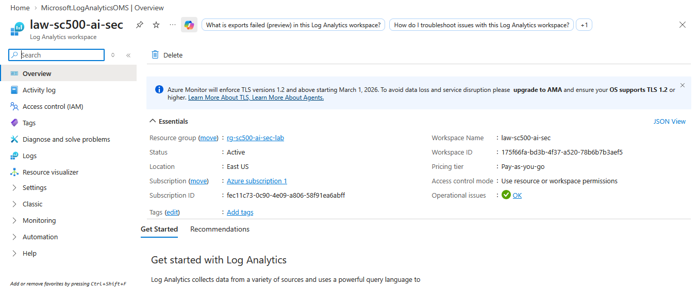

### 02. 02 Sentinel Workspace Selection

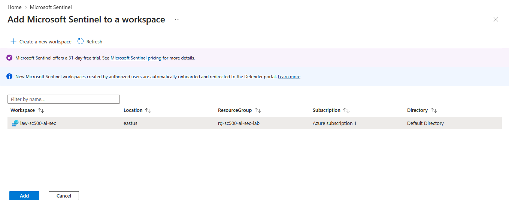

### 03. 03 Microsoft Sentinel Enabled

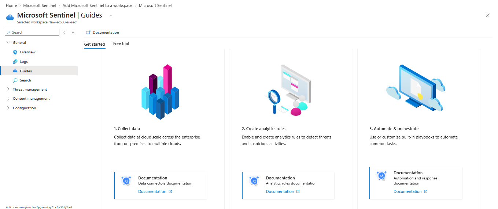

### 04. 04 Sentinel Free Trial Activated

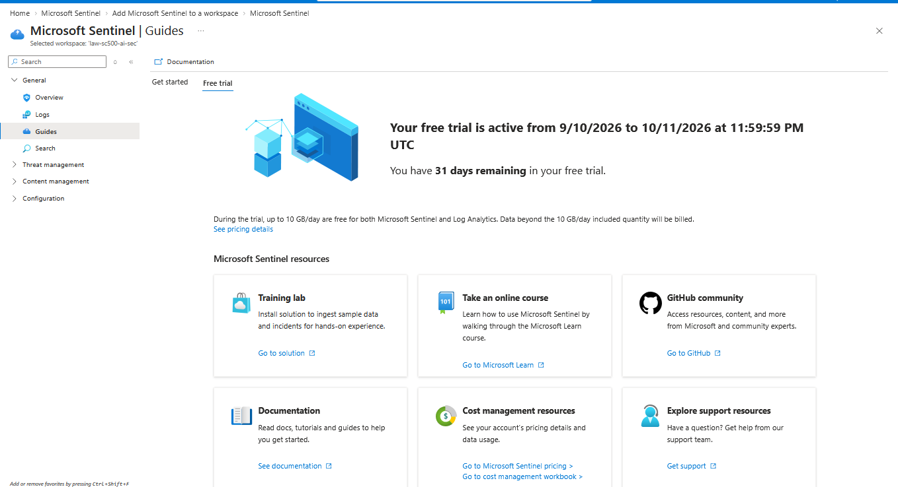

### 05. 05 Sentinel Overview Baseline

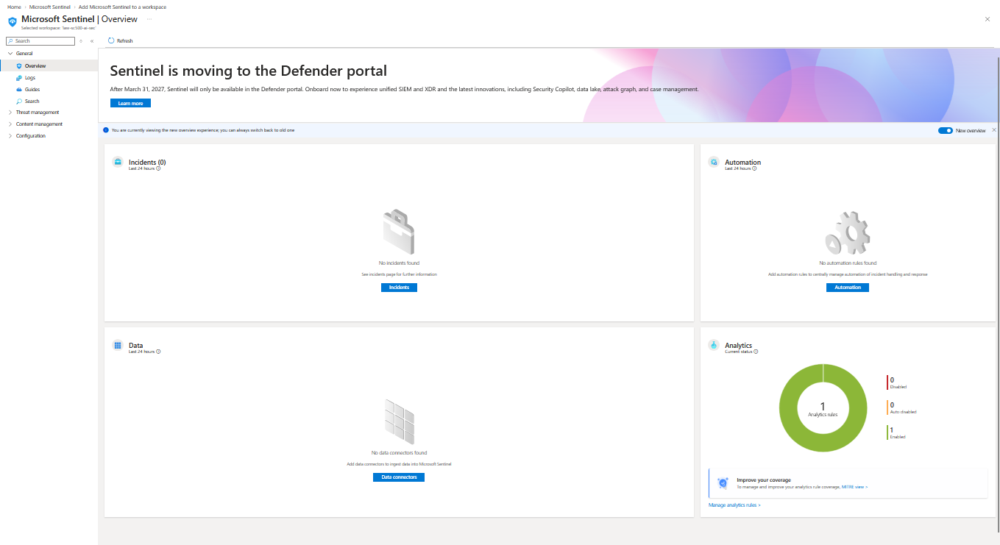

### 06. 06 Ai Security Detection Rules Baseline

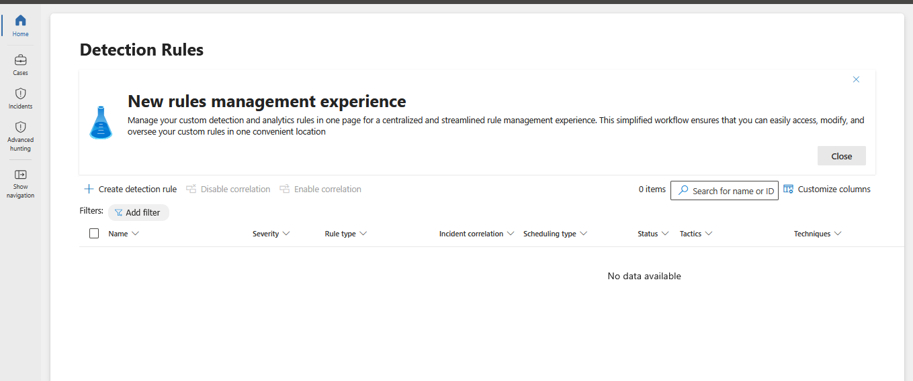

### 07. 07 Foundry Environment Baseline


### 08. 08 Foundry Resource Basics

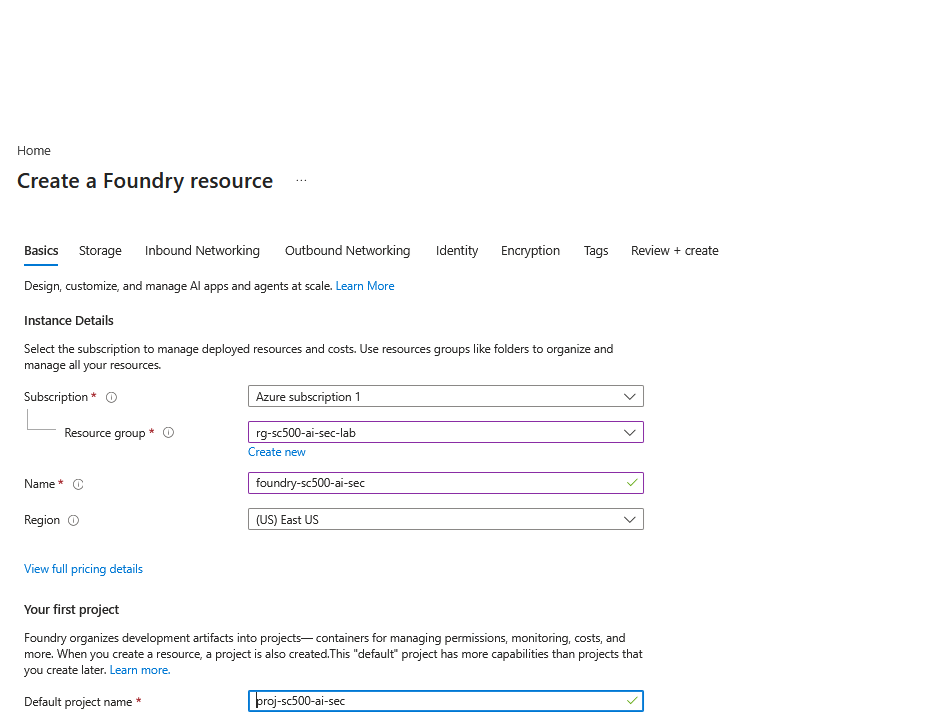

### 09. 09 Foundry Inbound Networking Baseline

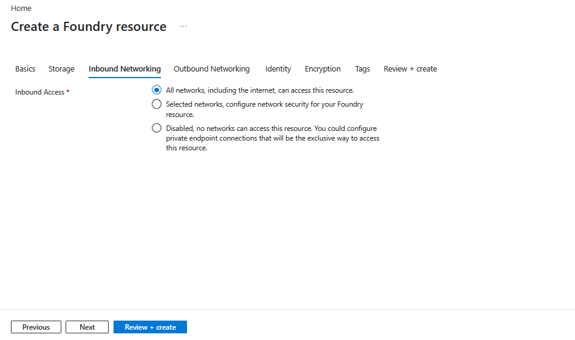

### 10. 10 Foundry Outbound Networking

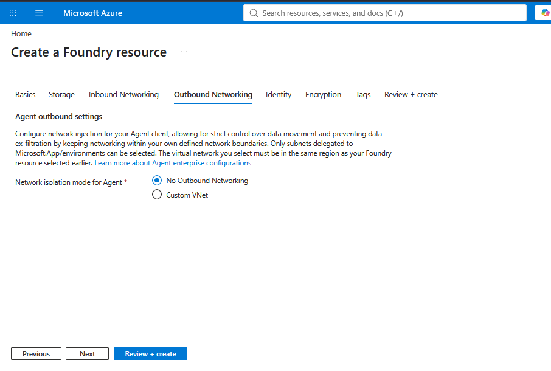

### 11. 11 Foundry Managed Identity

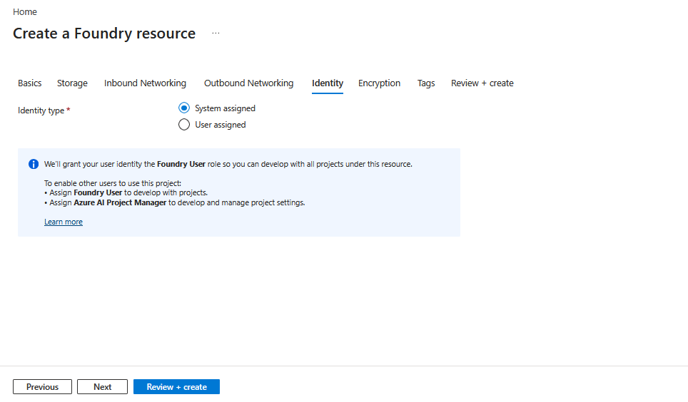

### 12. 12 Foundry Data Encryption

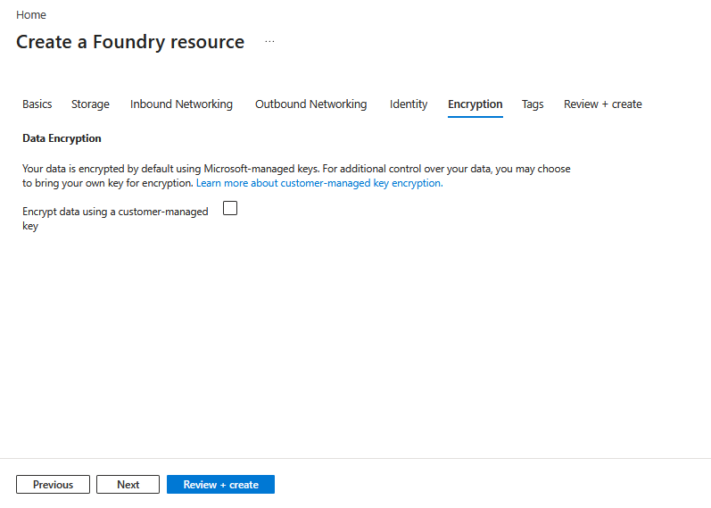

### 13. 13 Foundry Resource Tags

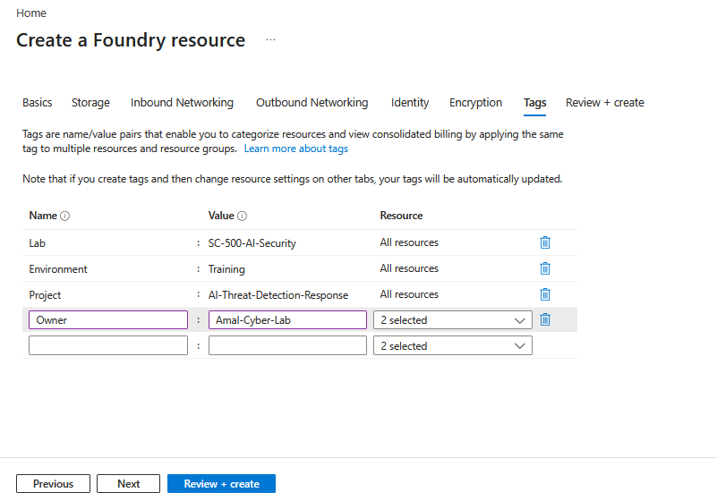

### 14. 14 Foundry Resource Review

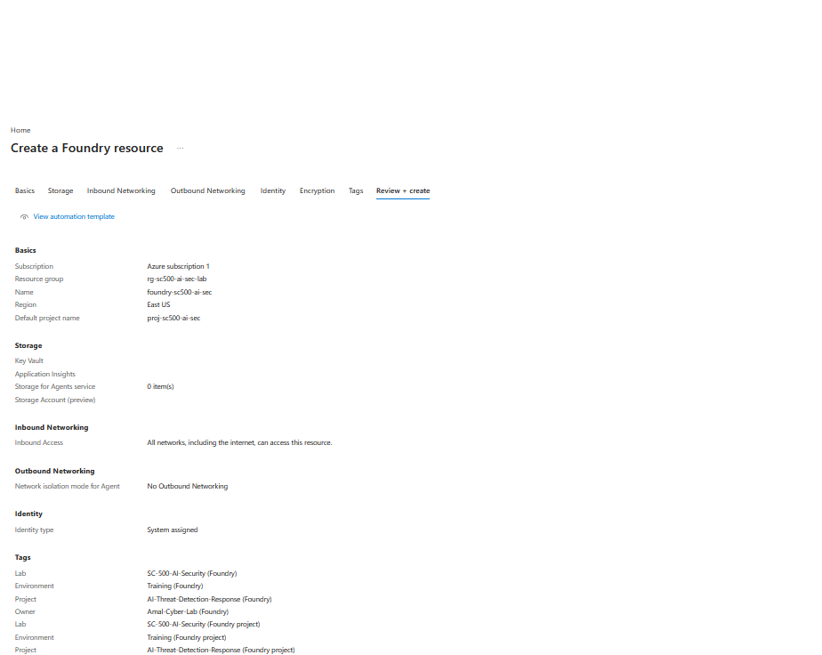

### 15. 15 Foundry Resource Deployed


### 16. 16 Foundry Project Baseline


### 17. 17 Foundry Model Deployment Baseline


### 18. 18 Foundry Model Details Gpt56 Luna


### 19. 19 Foundry Gpt56 Luna Deployment Settings

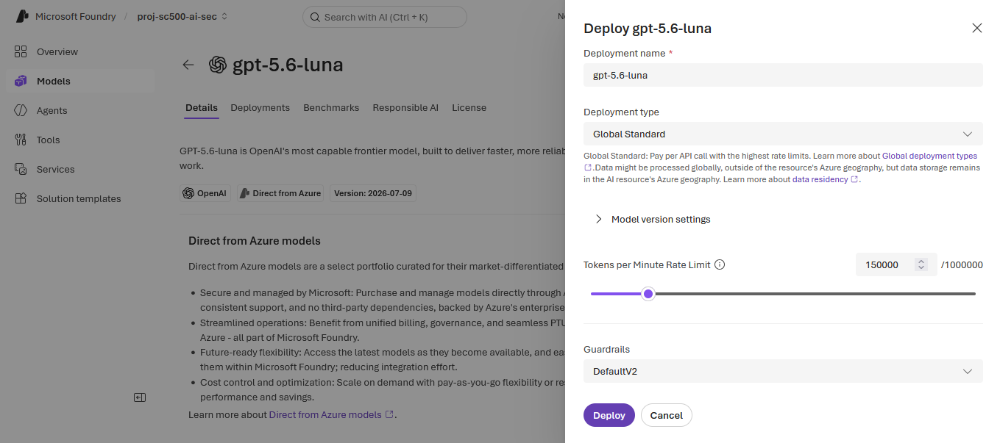

### 20. 20 Foundry Gpt56 Luna Deployed


### 21. 21 Foundry Diagnostic Settings Baseline


### 22. 22 Foundry Diagnostic Setting Configuration


### 23. 23 Foundry Diagnostic Setting Enabled


### 24. 24 Log Analytics Pre Traffic Baseline

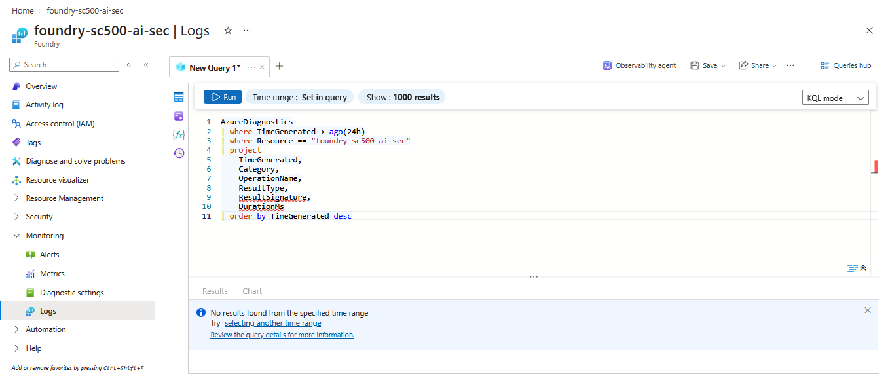

### 25. 25 Foundry Controlled Ai Telemetry Test


### 26. 26 Foundry Requestresponse Telemetry Confirmed

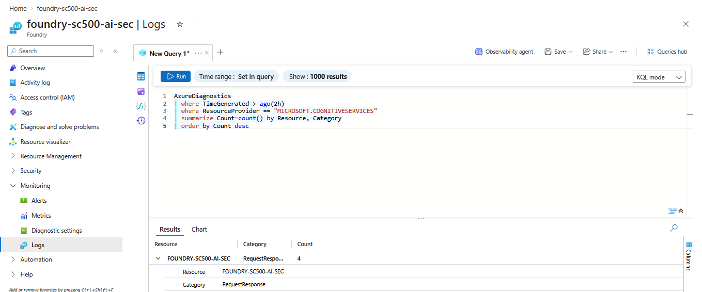

### 27. 27 Foundry Requestresponse Events Confirmed

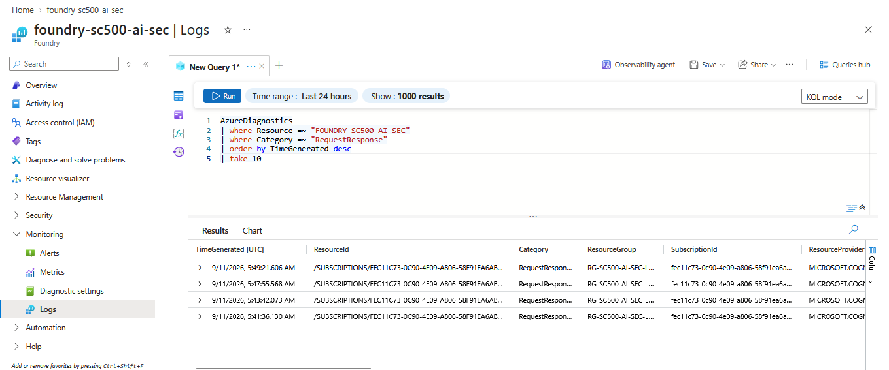

### 28. 28 Foundry Requestresponse Schema Discovered

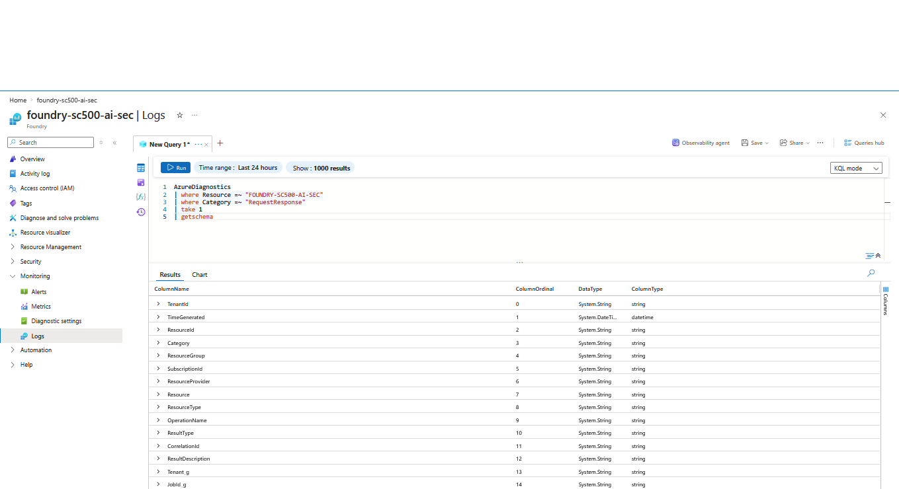

### 29. 29 Foundry Ai Telemetry Security Fields


### 30. 30 Foundry Requestresponse Evals Availability

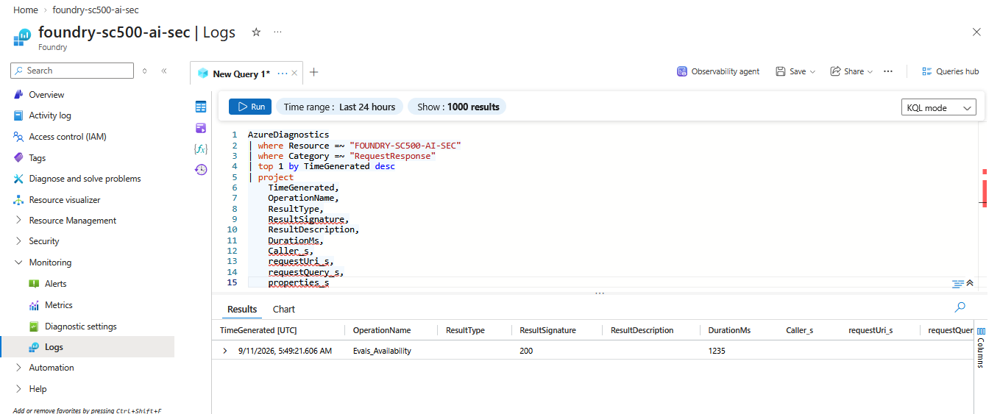

### 31. 31 Foundry Requestresponse Operation Baseline

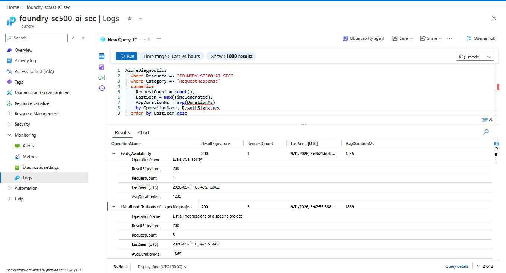

### 32. 32 Foundry Ai Metrics Confirmed


### 33. 33 Foundry Modelrequests Confirmed


### 34. 34 Foundry Modelrequests Aggregated


### 35. 35 Foundry Modelrequests Traffic Spike


### 36. 36 Ai Model Request Spike Detection Query


### 37. 37 Sentinel Ai Request Spike Mitre Mapping


### 38. 38 Sentinel Ai Request Spike Query Scheduling


### 39. 39 Sentinel Incident Settings


### 40. 40 Sentinel Automated Response Baseline

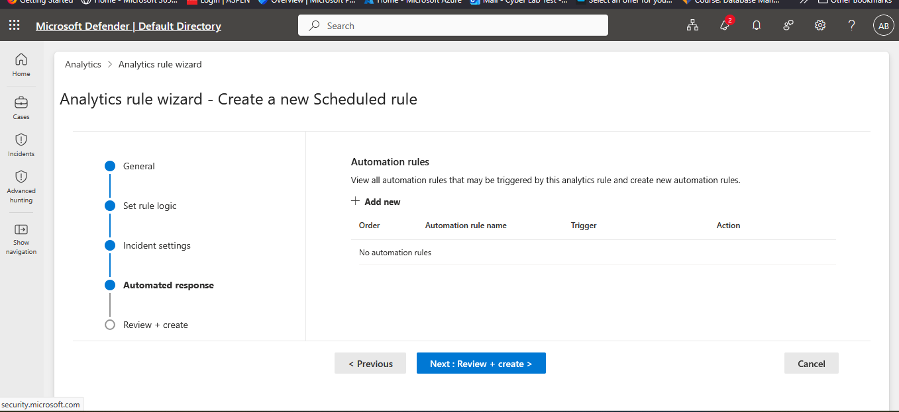

### 41. 41 Sentinel Ai Request Spike Rule Review


### 42. 42 Sentinel Ai Request Spike Rule Enabled


### 43. 43 Sentinel Ai Request Spike Incident Created


### 44. 44 Sentinel Incident Investigation Overview


### 45. 45 Sentinel Alert Details List


### 46. 46 Sentinel Alert Query Result 8 Requests


### 47. 47 Sentinel Alert Exact Kql Query


### 48. 48 Sentinel Incident Evidence Response Baseline


### 49. 49 Sentinel Incident Summary


### 50. 50 Sentinel Incident Classified Benign Positive


### 51. 51 Sentinel Incident Investigation Comment


### 52. 52 Sentinel Incident Resolved


> **Evidence note:** Before publishing, review screenshots to ensure subscription IDs, tenant identifiers, email addresses, account information, and other sensitive metadata are not exposed.

---

# 🏁 Final Outcome

The lab successfully demonstrated an end-to-end **AI Security Detection & Response pipeline** using Microsoft Azure and Microsoft Sentinel.

The final validated workflow was:

```text
AI Model Request
      ↓
Telemetry
      ↓
Log Analytics
      ↓
KQL Detection
      ↓
Sentinel Analytics Rule
      ↓
Alert
      ↓
Incident
      ↓
Investigation
      ↓
Classification
      ↓
Resolution
```

## Final Result

| Capability | Result |
|---|---|
| AI Workload | ✅ Deployed |
| Telemetry | ✅ Generated |
| Log Analytics Ingestion | ✅ Validated |
| KQL Detection | ✅ Successful |
| Sentinel Analytics Rule | ✅ Enabled |
| Alert | ✅ Generated |
| Incident | ✅ Created |
| Investigation | ✅ Completed |
| Classification | ✅ Benign Positive |
| Investigation Documentation | ✅ Completed |
| Resolution | ✅ Completed |

---

# 🚀 Future Enhancements

Potential production enhancements include:

- AI prompt-injection detection correlation
- Token-consumption anomaly detection
- HTTP 4xx/5xx anomaly detection
- Identity-based correlation with Microsoft Entra ID
- User/application/entity enrichment
- Microsoft Defender XDR correlation
- Automated Sentinel playbooks
- Threat intelligence enrichment
- UEBA-based anomaly detection
- Risk-based alert prioritization

These enhancements were intentionally excluded from the core lab to maintain a focused, cost-efficient detection engineering implementation.

---

# 👨‍💻 Author

**Amal Udayanga Basnayake**

Cybersecurity Engineer | Azure Security | SIEM & Threat Detection | Microsoft Security

### 🔗 Profiles

- GitHub: https://github.com/AmalUBasnayake
- Portfolio: https://amalcyberlab.vercel.app
- LinkedIn: https://linkedin.com/in/amal-udayanga-basnayake
- Medium: https://medium.com/@amalubasnayake

---

# ⭐ Project Classification

```text
Project Type:
Cloud Security / AI Security / SIEM / Detection Engineering

Platform:
Microsoft Azure

Security Platform:
Microsoft Sentinel

Query Language:
KQL

AI Platform:
Azure AI Foundry

Framework:
MITRE ATT&CK

Certification Alignment:
Microsoft SC-500
```

---

> **Built as part of the SC-500 Cloud & AI Security Engineer Master Class — hands-on security engineering portfolio.**
